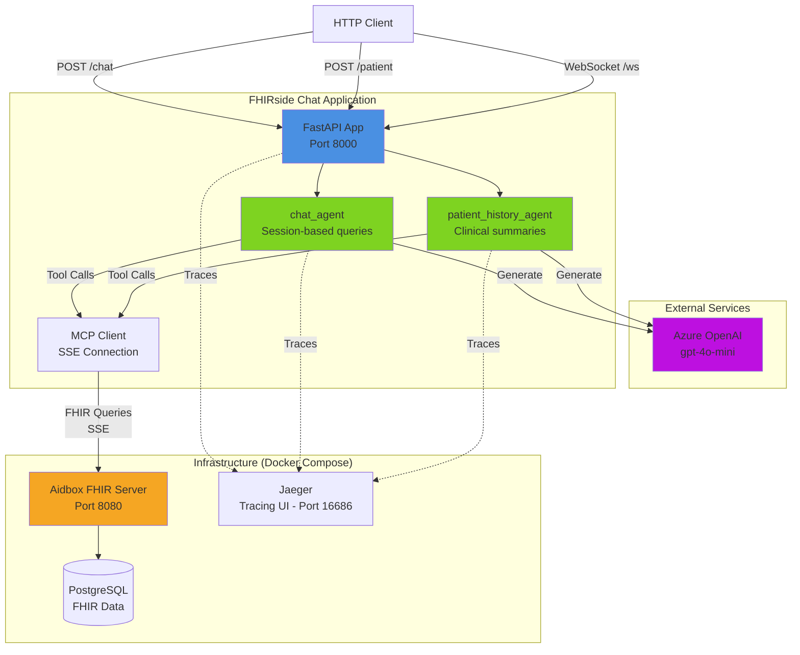

# High Level Architecture

## Technical Summary

FHIRside Chat employs a **modular monolithic architecture** with async event-driven patterns, built on FastAPI and PydanticAI. The system uses AI agents as the core abstraction for FHIR data access, with agents connecting to an Aidbox FHIR server through the Model Context Protocol (MCP) over Server-Sent Events. Azure OpenAI provides the language model capabilities, while OpenTelemetry ensures comprehensive observability. All components are orchestrated via Docker Compose, with the FastAPI application running as a separate process for development flexibility.

## High Level Overview

**1. Architectural Style: Modular Monolith**
- Single Python application with clear module boundaries (ai, models, app)
- Async/await patterns throughout for I/O-bound operations
- Event-driven agent interactions via PydanticAI framework
- RESTful HTTP endpoints + WebSocket support for real-time chat

**2. Repository Structure: Single Repository (Monorepo-lite)**
- All application code in one repository for simplicity
- Docker Compose configuration co-located with source
- Infrastructure definitions (Aidbox setup) in `aidbox/` directory
- Clear separation: source (`src/`), tests (`tests/`), docs (`docs/`)

**3. Service Architecture: AI Agent-Centric Design**
- **Primary Pattern:** Specialized AI agents handle different use cases
  - `chat_agent()` - Conversational FHIR queries with session context
  - `patient_history_agent()` - Structured clinical history generation
- **Agent Orchestration:** PydanticAI manages LLM interactions, tool calling, structured outputs
- **Data Access Layer:** MCP server provides FHIR query tools to agents (abstraction over Aidbox)
- **API Layer:** FastAPI endpoints expose agent capabilities via HTTP

**4. Primary Data Flow:**

```
HTTP Request → FastAPI Endpoint → AI Agent → MCP Tools → Aidbox FHIR Server
                                      ↓
                                 Azure OpenAI
                                      ↓
              Structured Response ← Agent ← LLM + FHIR Data
```

**5. Key Architectural Decisions & Rationale:**

- **AI Agents as Primary Abstraction**
  - *Decision:* Use PydanticAI agents rather than traditional service layers
  - *Rationale:* Enables natural language interfaces; agents handle complex FHIR querying logic; structured outputs via Pydantic models

- **MCP Protocol for FHIR Access**
  - *Decision:* Integrate Aidbox via Model Context Protocol (SSE transport)
  - *Rationale:* Standardized tool interface for LLMs; Aidbox provides MCP-native integration; keeps application logic decoupled from FHIR specifics

- **Stateless Agent Design (v1)**
  - *Decision:* No database persistence for chat sessions or patient histories
  - *Rationale:* Simplifies initial implementation; in-memory sessions sufficient for development; prepares for future scalability (stateless = horizontally scalable)

- **Azure OpenAI Dependency**
  - *Decision:* Single LLM provider (Azure OpenAI) with specific model configuration
  - *Rationale:* Enterprise-grade reliability; HIPAA-eligible deployment option; specific model testing (gpt-4o-mini); future multi-provider support possible via abstraction

- **Docker Compose Orchestration**
  - *Decision:* Use Docker Compose rather than Kubernetes or serverless
  - *Rationale:* Development-focused; simple local setup; manages Aidbox + PostgreSQL + Jaeger dependencies; production deployment to be determined

- **OpenTelemetry Integration**
  - *Decision:* Built-in observability from day one
  - *Rationale:* AI agent interactions are non-deterministic; tracing critical for debugging LLM calls, MCP queries, and performance analysis

## High Level Project Diagram



## Architectural and Design Patterns

**1. Agent Pattern (AI Orchestration)**
- **Description:** Encapsulate AI interactions in specialized agent functions with defined behaviors, tools, and output schemas
- **Implementation:** PydanticAI `Agent` instances with system prompts, MCP toolsets, and Pydantic result types
- **Rationale:** Provides clear abstraction for different AI capabilities; enables testing via agent mocking; system prompts are version-controlled and maintainable

**2. Model Context Protocol (MCP) - Tool Provider Pattern**
- **Description:** External services expose capabilities as "tools" that AI agents can discover and invoke
- **Implementation:** Aidbox MCP server provides FHIR query tools via SSE; agents use tools transparently through PydanticAI integration
- **Rationale:** Decouples application from FHIR query logic; Aidbox manages FHIR spec complexity; standardized protocol enables future tool additions

**3. Request/Response Pattern with Pydantic Models**
- **Description:** All API inputs/outputs are strongly-typed Pydantic models with validation
- **Implementation:** `PatientHistoryRequest`, `PatientClinicalHistory`, `ChatRequest`, `ChatResponse` models
- **Rationale:** Type safety for AI-generated development; automatic API documentation; JSON schema generation; validation at API boundaries

**4. Async/Await Throughout**
- **Description:** All I/O operations (HTTP, LLM calls, MCP queries) use Python async patterns
- **Implementation:** `async def` handlers, `await` for agent runs and MCP calls, FastAPI native async support
- **Rationale:** Efficient handling of concurrent requests; non-blocking I/O for LLM latency; natural fit for WebSocket support

**5. Structured Logging with OpenTelemetry**
- **Description:** Distributed tracing for all operations with automatic span creation
- **Implementation:** PydanticAI `instrument` parameter; OpenTelemetry SDK auto-instrumentation for FastAPI; Jaeger backend
- **Rationale:** Essential for debugging non-deterministic AI behavior; performance monitoring; correlation IDs across distributed calls

**6. Dependency Injection via Agent Toolsets**
- **Description:** Agents receive their dependencies (MCP connection, OpenAI client) at creation time
- **Implementation:** Agent functions instantiate required clients and pass as parameters
- **Rationale:** Testability via mock injection; clear dependency graph; follows functional composition patterns

## Rationale & Trade-offs

**Why Modular Monolith vs. Microservices:**
- *Pro:* Simplified deployment, debugging, and development workflow
- *Pro:* Lower operational overhead (no service mesh, single database)
- *Pro:* Easier to refactor and extract services later if needed
- *Con:* All components scale together (acceptable for v1 load)
- *Con:* Shared runtime (one component failure affects others)

**Why Stateless Design (No Persistence):**
- *Pro:* Horizontally scalable by default
- *Pro:* Simplified implementation (no schema migrations, backup strategies)
- *Pro:* Forces explicit caching/persistence decisions per use case
- *Con:* Chat sessions lost on restart (in-memory only)
- *Con:* No audit trail for generated clinical histories
- *Future:* PostgreSQL already available for when persistence is needed

**Why Azure OpenAI (Single Provider):**
- *Pro:* Enterprise support and HIPAA-eligible deployment
- *Pro:* Consistent model behavior during testing
- *Con:* Vendor lock-in for LLM provider
- *Con:* Cost optimization requires staying within Azure ecosystem
- *Mitigation:* PydanticAI abstracts provider; can add OpenAI, Anthropic, or local models later
